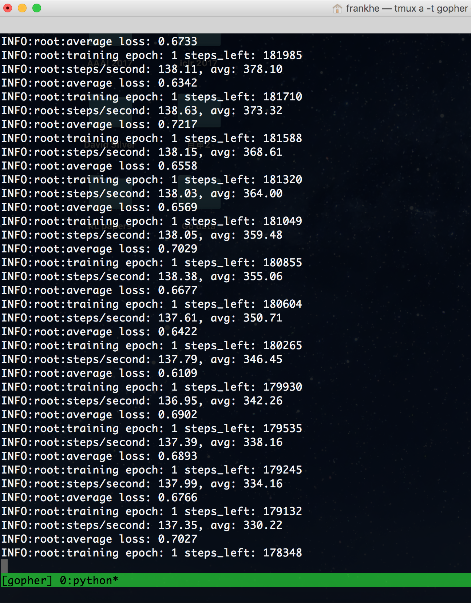

# Q-Optimality-Tightening
This is my implementation to paper [Learning to Play in a Day: Faster Deep Reinforcement Learning by Optimality Tightening](https://openreview.net/pdf?id=rJ8Je4clg). 

# Dependencies
* Numpy
* Scipy
* Pillow
* Matplotlib
* Theano
* Lasagne
* ALE or gym

Readers might refer to <https://github.com/spragunr/deep_q_rl> for installation information. However, I suggest readers installing all the packages using virtual environment. Please make sure the version of Theano is compatible with the one of Lasagne.

# Running
```
THEANO_FLAGS='deivce=gpu0, allow_gc=False' python run_OT -r frostbite --close2
```
Running frostbite with close boundes.

```
THEANO_FLAGS='device=gpu1, allow_gc=False' python run_OT -r gopher
```

Running gopher with randomly sampled bounds. Default: 4 out of 10 upper bounds are selected as U\_{j,k}. 4 out of 10 lower bounds are selected as L\_{j,l}.

I have already provided 62 game roms.

If everything is configured correctly, the running should be like this:




steps per second is usually between 105 to 140 using one Titan X. The GPU Occupation is about 30 percent which means our code still has huge space of improvement.


# Experiments
First I will show two figures runned on frostbite with ```--close2```:
![frostbite_cl2_1]
![frostbite_cl2_2]
Two other figures runned with sampling 4 bounds out of 15 are below:
![frostbite_r15_1]
![frostbite_r15_2]
> frostbite's 200M baseline is 328.3

Some other games are displayed here:
![gopher]
> gopher's 200M baseline is 8520

![hero]
> hero's 200M baseline is 19950

![star_gunner]
> star_gunner's 200M baseline is 57997

![zaxxon]
> zaxxon's 200M baseline is 4977

Finally, we can roughly compare our method with state-of-art method [A3C](https://arxiv.org/pdf/1602.01783). Our method is using 1 CPU thread and 1 GPU (GPU Occupation is 30%) while A3C is using multiple CPU threads.

Figure 4 in paper [A3C](https://arxiv.org/pdf/1602.01783):
![A3C]

Our results:

![beam_rider]
![breakout]
![pong]
![qbert]
![space_invaders]

From the observations, our method almost always outperforms 1,2 and 4 threads A3C and achieves similar results as 8 threads A3C. To be noticed, these five games chosen by A3C paper are not our method's specialties. Our method would definitely achieve much better performance if we run tests on games that our method is good at.

# Explain
### Gradients are also rescaled so that their magnitudes are comparable with or without penalty
![rescale]

### About frames
![frame]

# Comments
Since we never did grid search on hyperparameters, we expect finding better settings or initializations to further improve the results. More informed strategies regarding the choice of constraints are possible as well since we may expect lower bounds in the more distant future to have a larger impact early in the training. In contrast once the algorithm is almost converged we may expect lower bounds close to the considered time-step to have bigger impact. More complex penalty functions and sophisticated optimization approaches may yield even better results than the ones we reported yet.

# Please cite our paper at
```
@inproceedings{HeICLR2017,
  author = {F.~S. He, Y. Liu, A.~G. Schwing and J. Peng},
  title = {{Learning to Play in a Day: Faster Deep Reinforcement Learning by Optimality Tightening}},
  booktitle = {Proc. ICLR},
  year = {2017},
}
```

[frostbite_cl2_1]: figures/frostbite_cl2_1.png
[frostbite_cl2_2]: figures/frostbite_cl2_2.png
[frostbite_r15_1]: figures/frostbite_r15_1.png
[frostbite_r15_2]: figures/frostbite_r15_2.png
[gopher]: figures/gopher.png
[hero]: figures/hero.png
[star_gunner]: figures/star_gunner.png
[zaxxon]: figures/zaxxon.png
[A3C]: figures/a3c_fig.png
[beam_rider]: figures/beam_rider_time.png
[breakout]: figures/breakout_time.png
[pong]: figures/pong_time.png
[qbert]: figures/qbert_time.png
[space_invaders]: figures/space_invaders_time.png
[rescale]: figures/rescale.png
[frame]: figures/frame.png
